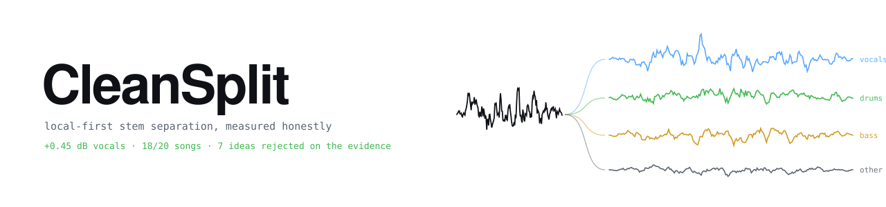
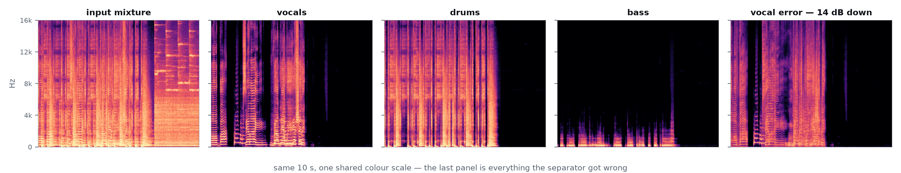
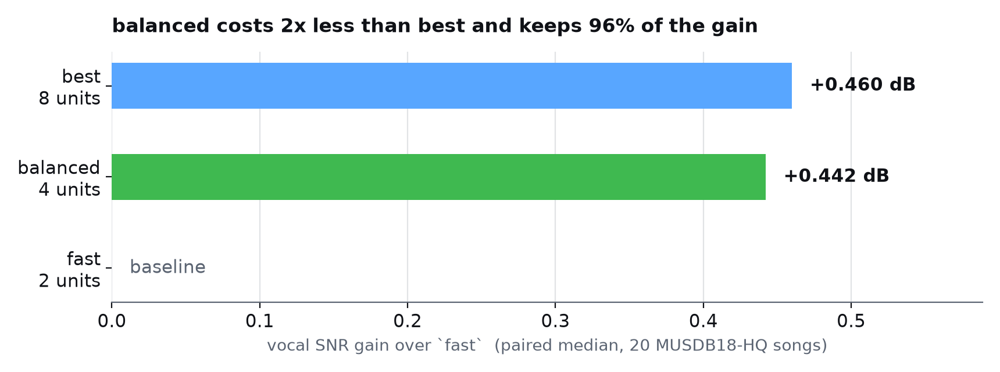

<div align="center">

<picture>
  <source media="(prefers-color-scheme: dark)" srcset="docs/assets/banner-dark.svg">
  <source media="(prefers-color-scheme: light)" srcset="docs/assets/banner-light.svg">
  
</picture>

<br>

[](LICENSE)
[](pyproject.toml)
[](cleansplit/tests)
[](docs/04_results.md)
[](docs/02_hardware_measurements.md)
[](#requirements)

**[Quick start](#quick-start)** · **[Quality tiers](#quality-tiers)** · **[Results](#results)** · **[What didn't work](#what-didnt-work)** · **[Docs](#documentation)**

</div>

---

Six-stem separation — vocals · drums · bass · guitar · piano · other — with **artifact-aware analysis** and
**mixture-consistent, region-restricted restoration**. Runs entirely on your machine.

```bash
cleansplit separate "song.wav"
```

<picture>
  <source media="(prefers-color-scheme: dark)" srcset="docs/assets/spectrograms-dark.png">
  
</picture>

## The point of this project

It exists to answer one question experimentally — and to be able to answer **"no"**:

> Can generative, artifact-aware restoration improve AI-separated audio while staying faithful to the original mix?

So far the measured answer is **no**. Seven restoration and ensembling ideas have been tested against real studio truth
and rejected. [What didn't work](#what-didnt-work) is the most useful section in this README, and it is not an apology —
a negative result measured properly is worth more than a positive result measured loosely.

Four rules are enforced **in code**, not in prose:

| | Rule | How it's enforced |
|:--:|---|---|
| 🔒 | **Clean audio stays untouched** | A restoration may only alter samples inside a detected time-frequency region. Everything else stays bit-identical, and that is asserted. |
| ➕ | **The mix must still add up** | Stems sum to the mixture sample-for-sample — `other` is the exact remainder. Break mixture consistency and the change is **auto-rejected**. |
| 📋 | **Rules are written before the run** | Every experiment's adoption rule lives in its script's docstring, pre-registered, with a falsifiable prediction and an explicit falsification condition. |
| 📊 | **Comparisons are paired** | Median-of-A minus median-of-B is banned. It manufactured two false results here before being caught ([§14.7](docs/04_results.md)) and is now blocked by [tests](cleansplit/tests/test_paired_statistics.py). |

Gains below **+0.02 dB** are never adopted, however consistent. A bar of "better than zero" buys inaudible gains at
unbounded cost — that floor is what cost overlap-8 and then test-time augmentation their places in the default recipe.
TTA never made a single song worse in 160 song-stem comparisons and was removed anyway, because reliability and
magnitude are different questions ([§14.15](docs/04_results.md)).

## Quick start

```bash
uv venv .venv --python 3.11
```
```bash
uv pip install --python .venv/Scripts/python.exe torch torchaudio --index-url https://download.pytorch.org/whl/cu128
```
```bash
uv pip install --python .venv/Scripts/python.exe -e ".[separation,dev]"
```
```bash
cleansplit doctor
```

Separate at the best measured quality — this is the default, you pass nothing:

```bash
cleansplit separate "song.wav"
```

Twice as fast, keeping 96% of the vocal gain:

```bash
cleansplit separate "song.wav" --quality balanced
```

Inspect it — lanes, solo/mute, A/B compare, flagged artifact regions:

```bash
cleansplit ui
```

## Quality tiers

<picture>
  <source media="(prefers-color-scheme: dark)" srcset="docs/assets/tiers-dark.png">
  
</picture>

Compute is counted in **forward passes**, never timed, so the ratios hold on any machine: `step = chunk // num_overlap`
makes cost linear in overlap, and TTA is exactly 3 passes.

| `--quality` | Recipe | Compute | Vocals vs `fast` | Notes |
|---|---|:--:|:--:|---|
| `fast` | SW alone, overlap 2 | **2** | — | 4× cheaper than `best` |
| `balanced` | SW + ep317, overlap 2, no TTA | **4** | **+0.442 dB** · 18/20 | **96% of best's gain.** Drums/bass *identical* to `fast` — measured at +0.0000 dB, 0/20 |
| `best` *(default)* | SW + ep317, overlap 4, no TTA | **8** | **+0.460 dB** · 18/20 | Also +0.095 dB drums, +0.061 dB bass |
| `--tta` on top | SW+TTA + ep317, overlap 4 | 16 | +0.464 dB · 18/20 | Opt-in. 2× the compute for +0.008 vocals — **below the floor** ([§14.15](docs/04_results.md)) |

> [!IMPORTANT]
> No tier advertises a single dB figure, because per song it ranges from **−0.09 dB to +5.12 dB**
> ([§14.11](docs/04_results.md)). Usually `fast` is close. Occasionally it collapses. Any explicit
> `--separator` / `--overlap` / `--tta` overrides the tier.

<details>
<summary><b>Why <code>balanced</code> works</b></summary>

<br>

Ranked by dB per doubling of compute ([§14.8](docs/04_results.md)):

| Lever | Cost | Gain | **dB per doubling** |
|---|:--:|:--:|:--:|
| **Average in a second model** | 1.33× | +0.42 dB | **+1.01** |
| Overlap 2 → 4 | 2× | +0.08 dB | +0.08 |
| TTA | 3× | +0.04 dB | +0.025 |
| Overlap 4 → 8 | 2× | +0.01 dB | +0.01 |

Averaging a second, architecturally different model is **~40× better value than test-time augmentation** and ~12×
better than doubling the overlap. `balanced` keeps the lever that pays and drops the two that barely do.

</details>

## Results

MUSDB18-HQ test set · 20 songs · real studio stems · 30 s excerpt centred on each track's midpoint, no content
selection. All deltas are **paired medians** with win counts. Full protocol: [`docs/04_results.md`](docs/04_results.md).

| Measurement | Result |
|---|---|
| Ensemble vocals vs single-pass SW | **+0.45 dB** · 18/20 songs |
| Same, on artifact-only SAR | **+1.12 dB** — the largest quality gain in the project |
| Chunk overlap 2 → 4 | +0.08 vocals · +0.09 drums · +0.07 bass · 14–19/20 |
| Artifacts vs bleed | SIR sits **10–11 dB above SAR** on every stem — bleed is solved, **artifacts are the remaining error** |
| Misallocation vs lost information | **~97%** of the error is audio filed under the wrong stem, not audio that is missing |

That last row is why single-stem generative repair cannot work here. The information is present in the mixture, just in
the wrong place — so it cancels in the sum, and no amount of "imagining" the missing part recovers it.

### Ceilings, measured before building anything

Both are computed by **reading the ground truth**. They can never ship. They exist to decide whether a feature is worth
writing at all — which is cheaper than writing it and finding out.

| Idea | Oracle ceiling | Verdict |
|---|:--:|---|
| Adaptive ensemble **weighting** | **+0.013 dB** | Axis closed permanently. Equal weighting is *exactly* optimal. |
| Per-tile **selector** — "listen, pick the better model" | **+0.38 dB** | A real budget, but unreachable without an external prior. |

## What didn't work

| Candidate | Outcome |
|---|---|
| **A2SB** generative inpainting | Rejected **23/23** by the mixture-consistency gate |
| **Apollo** codec restoration | Worse than doing nothing in **24 of 24** ground-truth measurements |
| **MDX23C** in the vocal ensemble | Worse on 16/20 songs once real truth was used |
| **HTDemucs_ft** averaged into drums/bass | −0.55 dB drums on **20/20** songs |
| **Wiener** post-filtering, 3 variants | −2.4 to −4.6 dB. Fails *by construction* — stems already sum to the mixture |
| **Overlap 8** | Real, but +0.01 dB for 2× the render time. Below the adoption floor |
| **4 truth-free tile combiners** | All rejected. Disagreement tells you *how much* error, never *which model* has it |
| **SCNet XL** in any stem | Worse on all four stems — and it **falsified** the project's own "comparable strength helps" rule on 3 of 4 |
| **TTA** in the default recipe | Dropped 2026-09-28. Never lost a single song in 160 comparisons, and *still* not worth 2× compute |

Two were nearly adopted on bad statistics, and both near-misses are written up rather than quietly deleted.
[§14.7](docs/04_results.md) traces a "+0.32 dB" gain that turned out to be an artefact of an unpaired median, and
explains why the sophisticated explanation reached for twice was the wrong one.

## How it works

```
 input ──▶ separate ──▶ reconstruct ──▶ detect ──▶ propose ──▶ ┌──────┐ ──▶ accept
              │              │            │          fix      │ GATE │
       ensemble of      residual vs   deterministic           └──────┘ ──▶ reject
       independent      the mixture   TF detectors +              │
       models                         synthetic benchmark         │
                                                    mixture consistency
                                                  + region containment
                                                  + bit-identical elsewhere
```

The gate is the point. It is built to say no, and it says no to almost everything.

## Requirements

- **Windows 10/11** (Linux likely fine, untested) · Python 3.10+
- **NVIDIA GPU** recommended — measured on an RTX 2080 Super Max-Q, 8 GB
  ([`docs/02`](docs/02_hardware_measurements.md)). CPU works, slowly. `ffmpeg` on PATH for non-WAV/FLAC input.
- **Model weights are not included and never downloaded.** `BS-Rofo-SW-Fixed` comes from an existing Ultimate Vocal
  Remover 5.6 install. Its licence is unknown and its trainer unidentified, so CleanSplit does not redistribute it.

## Documentation

| Document | Contents |
|---|---|
| [`docs/01_research_decision_report.md`](docs/01_research_decision_report.md) | Architecture research, model survey, primary sources |
| [`docs/02_hardware_measurements.md`](docs/02_hardware_measurements.md) | Real throughput and VRAM on 8 GB |
| [`docs/03_artifact_detectors.md`](docs/03_artifact_detectors.md) | Detectors and the synthetic ground-truth benchmark |
| [`docs/04_results.md`](docs/04_results.md) | **Every measurement, including the failures.** Start at §14 |
| [`HANDOFF.md`](HANDOFF.md) | Running engineering log, newest entry first |
| [`QUICKSTART.md`](QUICKSTART.md) | Command reference |

## Licence

MIT for CleanSplit's own code — see [`LICENSE`](LICENSE), which also lists the vendored third-party components
(`bs_roformer/`, `mdx23c/`, `scnet/` MIT · `ui/static/vendor/` BSD-3 · `third_party/apollo/` CC BY-SA 4.0) and states
plainly that model weights are not redistributed.
